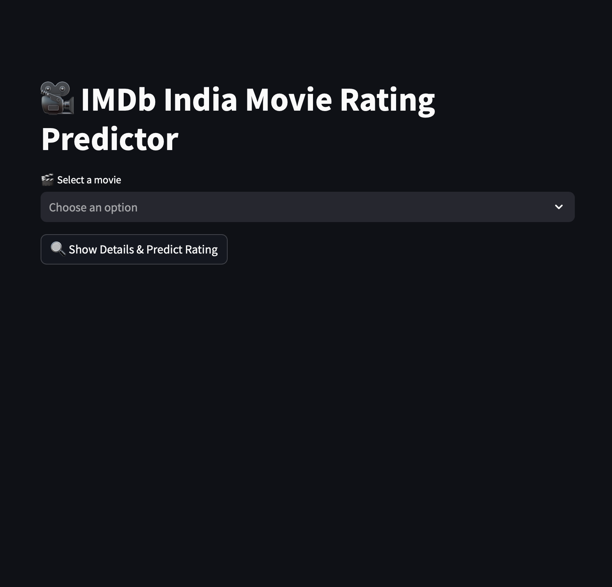
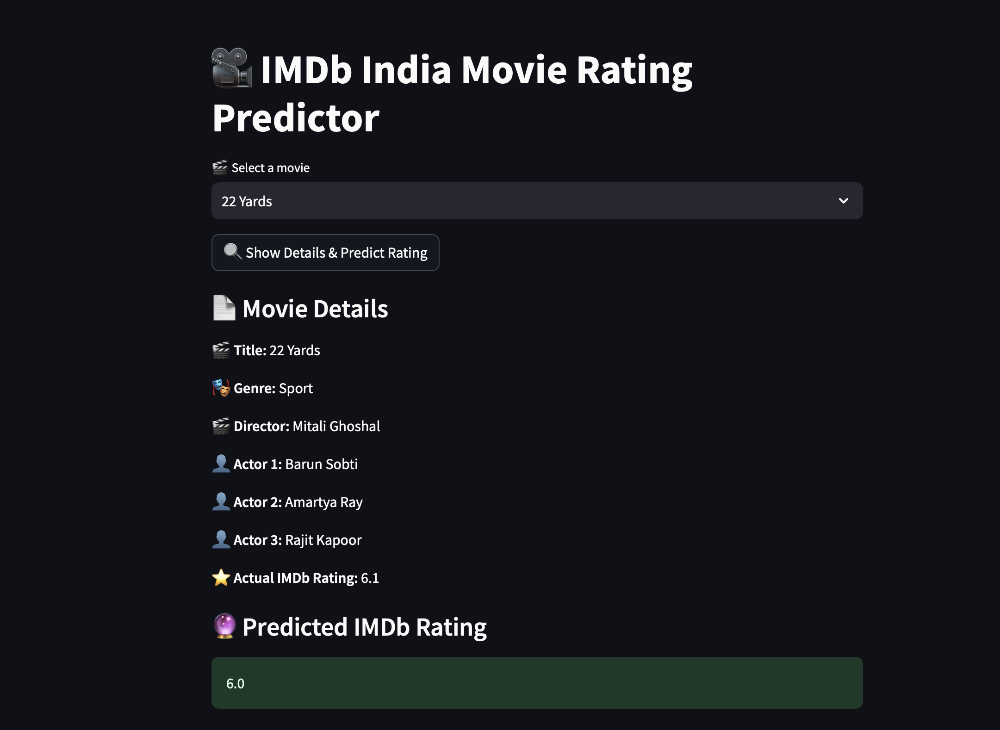

# 🎬 Movie Rating Predictor using Machine Learning

This project was completed as part of my **GenAI Internship** at **System Tron** (Week01) . The objective of this task was to build and deploy a machine learning model that predicts the **IMDb rating** of a movie based on key attributes like **title, director, genre, and actors** using regression techniques.

---

## 📌 Task Objective

Develop and deploy a **regression-based ML model** that can intelligently estimate the IMDb rating of a movie given its metadata. The final deliverable includes a **Streamlit-powered web application** that lets users enter movie details and instantly view the predicted rating.

---

## 🛠️ Technologies Used

* Python
* Streamlit
* Pandas
* NumPy
* scikit-learn

  * Linear Regression
  * Label Encoding
  * Train-Test Split
  * Evaluation Metrics (`MSE`, `R² Score`)
* Jupyter Notebook
* Pickle / JSON (for model and encoder saving)

---

## 📁 Project Structure

```
movie-rating-predictor/
│
├── MovieRatingPrediction.ipynb   # Jupyter Notebook for model training and evaluation
├── movie_dataset.csv             # Cleaned dataset of movies with metadata
├── movie_rating_model.pkl        # Trained ML model (Linear Regression)
├── encoders.pkl                  # Saved LabelEncoders for categorical fields
├── model_features.json           # Feature columns used in training
├── app.py                        # Streamlit web app for real-time predictions
├── README.md                     # Project documentation
```

---

## 🎞️ Dataset Description

The dataset includes a collection of movies with the following attributes:

* `Title`
* `Genre`
* `Director`
* `Actors`
* `Rating` (IMDb score, the target variable)

Key features used for prediction:

* Categorical columns encoded: `Title`, `Genre`, `Director`, `Actors`
* Regression target: `Rating` (continuous value between 1–10)

---

## 🔄 ML Workflow

1. Data preprocessing and null-value handling
2. Label encoding for all categorical fields
3. Feature and target separation
4. Model training using `LinearRegression`
5. Performance evaluation using `MSE` and `R² Score`
6. Saving model and encoders using `pickle`
7. Building an interactive web app using `Streamlit`

---

## 🖥️ Web App Features

* Enter movie **title**, **genre**, **director**, and **actors**
* Submit and get the **predicted IMDb rating** instantly
* Displays both the predicted rating and actual rating (for known test cases)
* Simple and clean UI for easy testing and demonstration

---

## 📷 Screenshot

> *Include screenshots of your Streamlit app here (optional)*
> 
> 

---

## 🔧 Future Scope

* Upgrade to ensemble models (e.g., RandomForest, XGBoost) for better accuracy
* Add more features: year, runtime, budget, country, language, etc.
* Use embeddings for text-based fields (actors, genres)
* Deploy online using Streamlit Cloud, Hugging Face, or Render
* Add movie poster fetch API and ratings comparison chart

---

## 🎓 Internship & Task Details

* **Internship Track**: Generative AI & Machine Learning
* **Internship Provider**: System Tron
* **Week**: Week 01
* **Task Name**: Movie Rating Prediction Model
* **Environment**: Jupyter Notebook + Streamlit Web App 

---

## 📬 Contact

**Your Name**
📧 [your.email@example.com](difina.georgecs@gmail.com)
📍 Kerala, India
